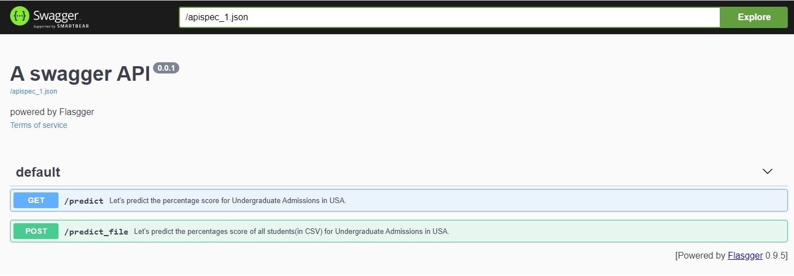
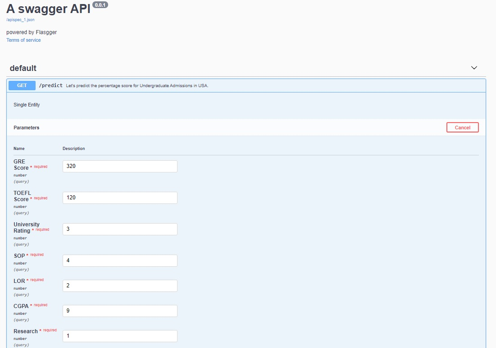
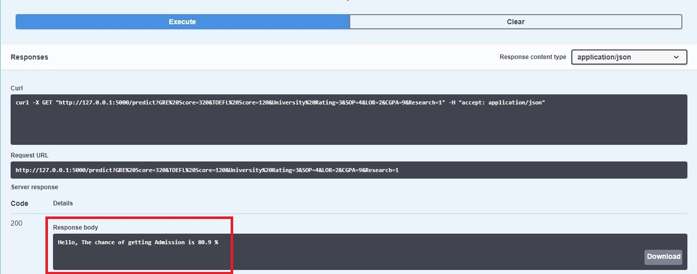
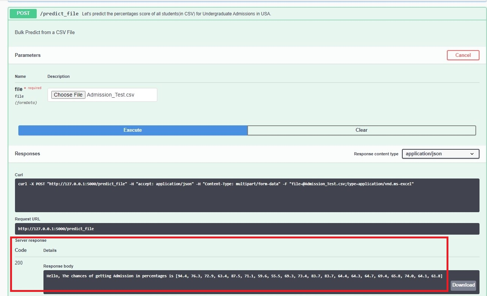

# Elasticnet Regression over Graduate Admissions dataset.
      https://www.kaggle.com/mohansacharya/graduate-admissions/home

### Simple Application Demo using Swagger. UI handling is partly taken care by Swagger and developer has much visibility on internal flow, parameters/integrations.

# Using
##  1. Flask
##  2. Swagger

## Single Entity Prediction

## Bulk records(Inputs in CSV) Prediction 

